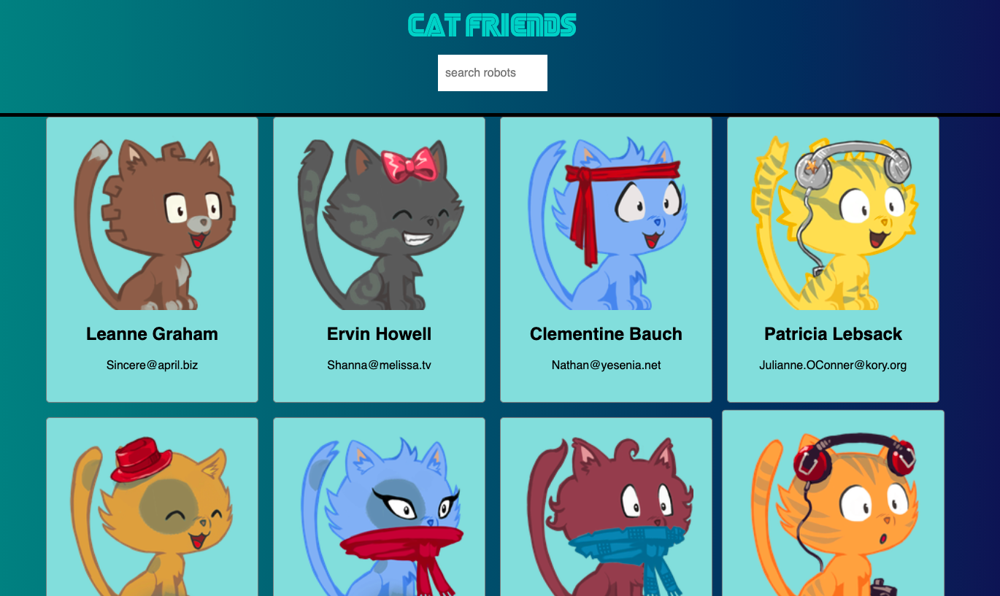

# React + TypeScript project

Adding TypeScript to my cat friends app!  https://github.com/kanjamad/cat-friends-react.js-app

## Tech Stack
---
- TypeScript
- Javascript
- React.js
- HTML
- CSS
- ESlint
- Prettier


## Adding TypeScript
To start a new Create React App project with TypeScript, you can run:
```
npx create-react-app my-app --template typescript

# or

yarn create react-app my-app --template typescript

```

To add TypeScript to an existing Create React App project, first install it:
```
npm install --save typescript @types/node @types/react @types/react-dom @types/jest

# or

yarn add typescript @types/node @types/react @types/react-dom @types/jest
```

Next, rename any file to be a TypeScript file (e.g. src/index.js to src/index.tsx) and restart your development server!
> https://create-react-app.dev/docs/adding-typescript/
## External API used
---
- https://jsonplaceholder.typicode.com/users

## Deploying React APP
- https://create-react-app.dev/docs/deployment/#github-pages


## Additional Resources
1. <a href="https://create-react-app.dev/docs/deployment/#github-pages" target="_blank">Deploying React APP</a>